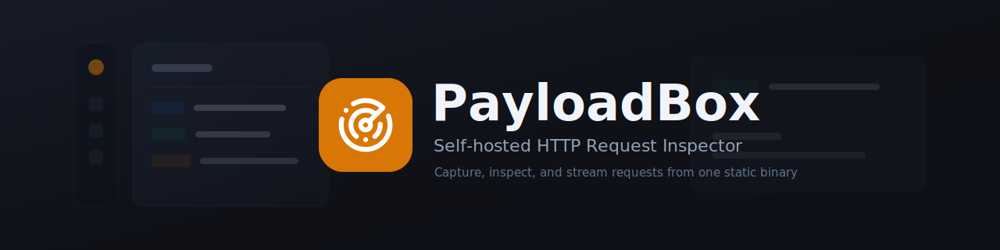

<div align="center" markdown="1">



Lightweight, self-hosted HTTP Request Inspector with a built-in web interface. Capture any HTTP request, inspect headers and bodies live in your browser, and stream new captures over Server-Sent Events - all from a single static binary.

[](https://github.com/ByteFork/payloadbox/actions/workflows/go.yml)
[](https://github.com/ByteFork/payloadbox/actions/workflows/ui.yml)
[](https://github.com/ByteFork/payloadbox/releases/latest)
[](LICENSE)
[](https://goreportcard.com/report/github.com/ByteFork/payloadbox)

</div>

## Features

- Captures arbitrary HTTP requests while reserving `/`, `/index.html`, and `/assets/*` for the built-in web UI
- Built-in web interface for browsing captures, inspecting headers/body/query data, and copying replayable cURL commands
- JSON API for listing, fetching, streaming, and clearing captured requests
- Server-Sent Events stream with a 30-second heartbeat for long-lived connections
- Bounded in-memory ring buffer; oldest records evicted when full
- Per-request body-size limit with graceful 413 (still recorded)
- Published as Distroless Static and Alpine Linux container images

### User Interface

<div align="center">


</div>

## Usage

Start the server and send it a request:

```bash
~ payloadbox
{"time":"2026-04-23T19:00:00Z","level":"INFO","msg":"starting server","address":":8080"}

~ curl -X POST http://localhost:8080/webhooks/test \
    -H 'Content-Type: application/json' -d '{"event":"ping"}'
Request logged POST /webhooks/test

~ curl -s http://localhost:8080/api/v1/history | jq -r '.[-1].request.path'
/webhooks/test
```

Watch captures arrive live:

```bash
~ curl -N http://localhost:8080/api/v1/events
event: record
data: {"created_at":"2026-04-23T19:00:01Z",...}
```

Open the built-in web interface:

```bash
~ open http://localhost:8080
```

The UI is embedded in the binary, so there is no separate frontend server to run.

### Container Image

```bash
docker run --rm -p 8080:8080 ghcr.io/bytefork/payloadbox:latest
```

## Configuration

Environment variables only.

| Variable | Default | Description |
|---|---|---|
| `LISTEN_ADDRESS` | `:8080` | Host and port to bind |
| `MAX_BODY_SIZE_BYTES` | `5120` | Per-request body limit; over-limit returns 413 but is still recorded |
| `MAX_RECORDS_TO_STORE` | `200` | Ring-buffer capacity |
| `LOG_HTTP_REQUESTS` | `true` | Log each capture to stdout |
| `LOG_LEVEL` | `info` | One of `debug`, `info`, `warn`, `error` |

## API

| Method | Path | Purpose |
|---|---|---|
| `ANY` | `/*` | Capture endpoint, except UI assets and built-in API routes |
| `GET` | `/` | Embedded web UI |
| `GET` | `/api/v1/history` | List records (gzip when accepted) |
| `GET` | `/api/v1/history/{id}` | Get one record by ID (gzip when accepted) |
| `DELETE` | `/api/v1/history` | Clear records |
| `GET` | `/api/v1/events` | SSE stream of new records |
| `GET` | `/api/v1/settings` | Current effective config |
| `GET` | `/version` | Build metadata |
| `GET` | `/healthz` | Liveness probe |

## Installation

### Install script

```bash
curl -fsSL https://install.bytefork.io/payloadbox | sh
```

Installs the latest release to `/usr/local/bin`. The script detects your OS and architecture, downloads the matching release asset, and verifies SHA-256 against the release's `checksums.txt`.

To pin a specific version:

```bash
curl -fsSL https://install.bytefork.io/payloadbox | sh -s -- --version v0.0.1
```

Pass `--help` for other options.

### Kubernetes

Install the Helm chart from the ByteFork chart repository:

```bash
helm repo add bytefork https://bytefork.github.io/helm-charts
helm repo update
```

Create a values file and adjust it for your cluster, especially the image tag,
ingress class, and host name:

```yaml
# payloadbox-values.yaml
deployment:
  enabled: true

probes:
  readiness:
    enabled: true
  liveness:
    enabled: true

ingress:
  enabled: true
  className: traefik
  annotations:
    kubernetes.io/ingress.class: traefik
    traefik.ingress.kubernetes.io/router.entrypoints: websecure
    traefik.ingress.kubernetes.io/router.tls: "true"
    traefik.ingress.kubernetes.io/router.tls.certresolver: letsencrypt
  hosts:
    - host: payloadbox.example.com
      paths:
        - path: /
          pathType: Prefix
```

Install PayloadBox:

```bash
helm install payloadbox bytefork/payloadbox \
  --namespace payloadbox \
  --create-namespace \
  --values payloadbox-values.yaml
```

To apply changes later:

```bash
helm upgrade payloadbox bytefork/payloadbox \
  --namespace payloadbox \
  --values payloadbox-values.yaml
```

### Alternative methods

Download a binary directly from [Releases](https://github.com/ByteFork/payloadbox/releases), or install from source:

```bash
go install github.com/ByteFork/payloadbox@latest
```

## Development

See [CONTRIBUTING.md](CONTRIBUTING.md).

## License

This repository is [MIT](LICENSE) licensed.
